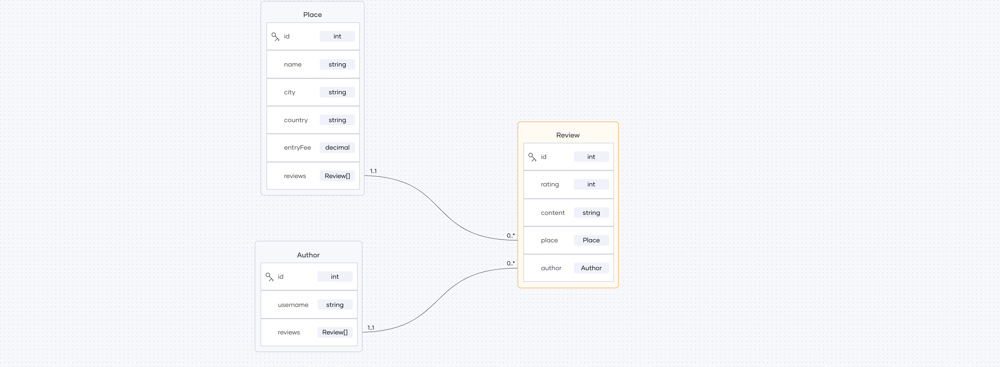

# Backend implementation for Reviewed!

A backend implementation for Reviewed!, a platform to review places.

Reviewed! let's you 
- retrieve all places for which reviews can be done, with city, country, and rating
- retrieve details of a specific place, including city, country, rating, time zone, city population, and all the current reviews for the place
- retrieve all the reviews by a particular author
    - a review consists of a rating and review content for a particular place

### GraphQL diagram generated by Ballerina

### Developing the GraphQL backend

#### Level 0 - Initial data

- Branch - https://github.com/ballerina-guides/wso2con-24/tree/session-3-level-0

- Consists of in-memory data to get started with the GraphQL implementation. Use this to implement subsequent levels.

- Three main entities: Place, Author, and Review

    

